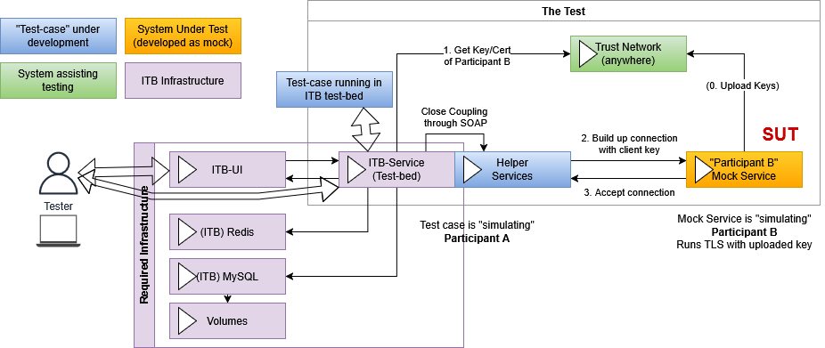
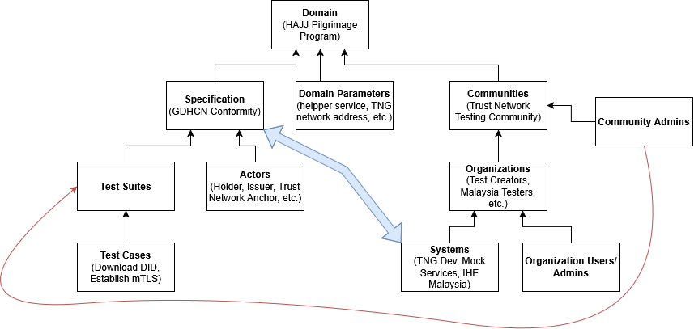

# HAJJ Program ITB (PoC)
Welcome to the repository of my Interpoperability Test Bed (**ITB**) instance, originally developed for a single test case called mTLS, then expanded to be a general entry point for new testers and test-cases of the running HAJJ program.

## Table of Contents
- [Repository contents](#repo-contents)
- [Prerequisites](#prerequisites)
- [Installation](#installation)
- [Users](#users-for-immediate-usage)
- [Project Overview](#project-overview)
- [Links](#links)

## Repo contents
As a quick overview, this repository contains:
+ A running, empty Interoperability Test Bed instance (GITB) with all required containers;
+ All shelper services with full sourcecode and as containers,
+ An initial configuration of a domain with communities, organizations, users and admins, etc.;
+ Test-cases for the HAJJ program + deployment script,
+ Small .http and PyTest test-cases for poke-prod and test-case PoC before the ITB cases are built.
More details at the bottom.

## Prerequisites
### Prerequisites for running
- Git
- Docker with compose
- A browser
### Prerequisites for development and testing
- Java 21 (recommended)
- Maven 3.9
- Python 3.13 with "requests"
- Visual Studio Code with REST Client installed

### Installation
1. Clone the repository:
   ```bash
   git clone https://github.com/szalaierik-tsch/WHO-HAJJ-mTLS-ITB-impl.git
   cd WHO-HAJJ-mTLS-ITB-impl
2. Build and start the composition with Docker on your local machine:
    ```bash 
    docker-compose up
3. Go to http://localhost:9003 in your browser.
4. Log in with a predefined user.

### Users for immediate usage


## Project overview
### Architecture of this setup

### Diagram example of the ITB setup


# Links and further reading
## Introduction to the ITB
